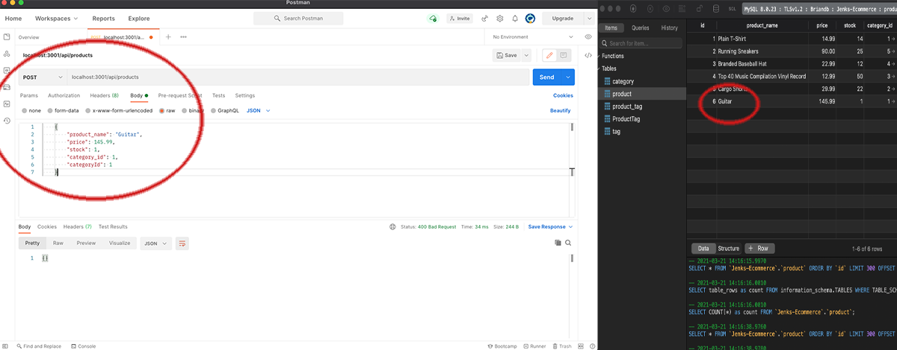

# ORM-Ecommerce

## Description
An e-commerce back endconfigured using Sequelize. Connect to the database, and have functioning CRUD commands.

## Table of Contents

* [Installation](#installation)

* [Usage](#usage)

* [License](#license)

* [Contributing](#contributing)

* [Contact](#contact)

-----------

## Installation
Make sure node.js is installed on your computer. Clone directory from the repo. From directory within the terminal, initialize npm by typing npm init -y. Create a .gitignore file and add node_modules to the list directory. 

_________

## Screenshots

**Above: Example of adding a product to database**  

_________
## Instruction Video

* https://drive.google.com/file/d/1Y3kUrKVLLSWi9Vy37LdhAZ7cqrKvTVJo/view

_________

## Usage
For back end implementation

_________

## License
MIT License - 
_________

## Contributing
Inquiries can be sent to me at my email address below.

# Contact
*********

* Github[Github]https://github.com/bjenkins63

* Email[Email]mailto:studiojenkins@yahoo.com